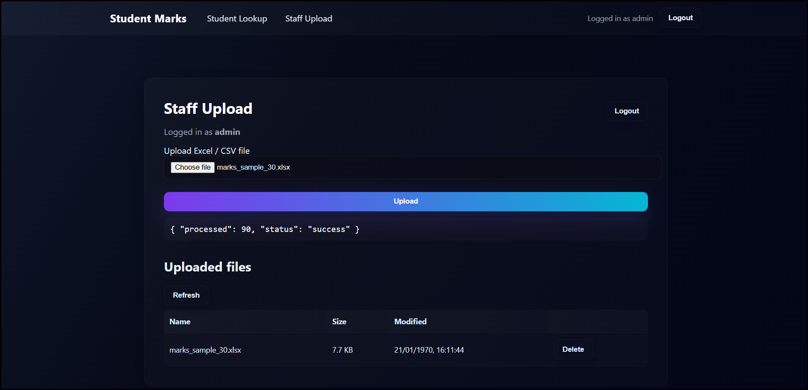
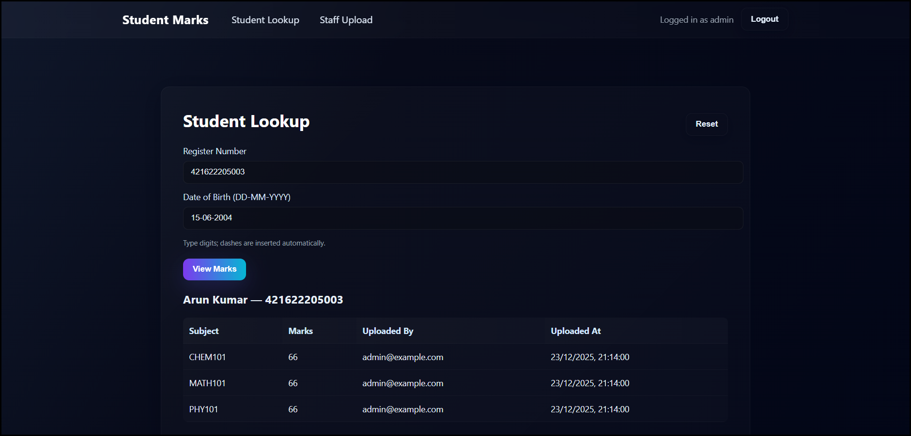

# 🎓 Student Marks Management System

A full-stack web application to manage student marks.  
Staff can upload marks via Excel/CSV files, and students can securely view their results using their register number and date of birth.

Built with **React**, **Flask**, **MongoDB**, and **Docker**.

---

## 🚀 Features

### 👩‍🏫 Staff / Admin
- Secure login with JWT
- Upload marks using Excel or CSV files
- Admin can:
  - View uploaded files
  - Delete uploaded files
- Role-based access (staff vs admin)
- ### 📤 Staff Upload


### 🗂️ Admin Panel


### 🎓 Students
- Lookup marks using:
  - Register Number
  - Date of Birth
- View subject-wise marks instantly
- ### 📊 Student Results


### ⚙️ System
- JWT authentication
- Password hashing with bcrypt
- MongoDB for storage
- Dockerized setup
- Modern UI with glassmorphism style

---

## 🛠 Tech Stack

- **Frontend**: React (Create React App)
- **Backend**: Flask (Python)
- **Database**: MongoDB
- **Auth**: JWT + bcrypt
- **Containerization**: Docker & Docker Compose

---
student-marks-app/

│

├── backend/

│ ├── app.py

│ ├── models.py

│ ├── requirements.txt

│ └── Dockerfile

│
├── frontend/

│ ├── src/

│ │ ├── StaffUpload.jsx

│ │ ├── StudentLookup.jsx

│ │ └── styles.css

│ ├── package.json

│ └── Dockerfile

│
├── docker-compose.yml

└── README.md


---

## ✅ Prerequisites

Make sure you have:

- Node.js (v18+)
- Python (3.10+)
- Docker & Docker Compose
- Git

---

## ▶️ Run Locally (Docker)

From the project root:

```bash
docker compose down -v
docker compose up --build

Services:

Frontend → http://localhost:3000

Backend → http://localhost:5000

MongoDB → localhost:27017

▶️ Run Without Docker (Optional)
Backend
cd backend
pip install -r requirements.txt
python app.py


Backend runs on:
👉 http://localhost:5000

Frontend

Add proxy in frontend/package.json:

"proxy": "http://localhost:5000"


Then:

cd frontend
npm install
npm start


Frontend runs on:
👉 http://localhost:3000

🔐 Create Admin User

Run inside backend container:

docker exec -it marks-backend python


Then:

from pymongo import MongoClient
import bcrypt

client = MongoClient("mongodb://mongo:27017/student_marks_db")
db = client.get_default_database()

email = "admin@example.com"
password = "admin123"

pwd = bcrypt.hashpw(password.encode(), bcrypt.gensalt()).decode()
db.staff.insert_one({"email": email, "password_hash": pwd, "role": "admin"})
print("Admin created")


Login with:

Email: admin@example.com
Password: admin123

📑 Excel / CSV Format

Your upload file should contain columns:

register_number | student_name | subject_code | marks | dob


Example:

register_number	student_name	subject_code	marks	dob
101	John Doe	MATH101	85	2004-01-15
🧪 Health Check
http://localhost:5000/api/health


Should return:

{ "status": "ok" }

🧑‍💻 Author

Guhan
College Student | Full Stack Developer
Built as an academic & portfolio project.

📜 License

This project is open-source and free to use for educational purposes.


---

## ✅ Next Steps

After adding this file:

```powershell
git add README.md
git commit -m "Add project README"
git push origin main
## 📂 Project Structure

